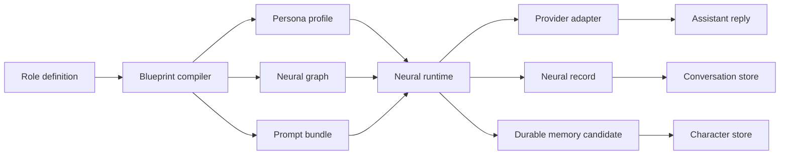
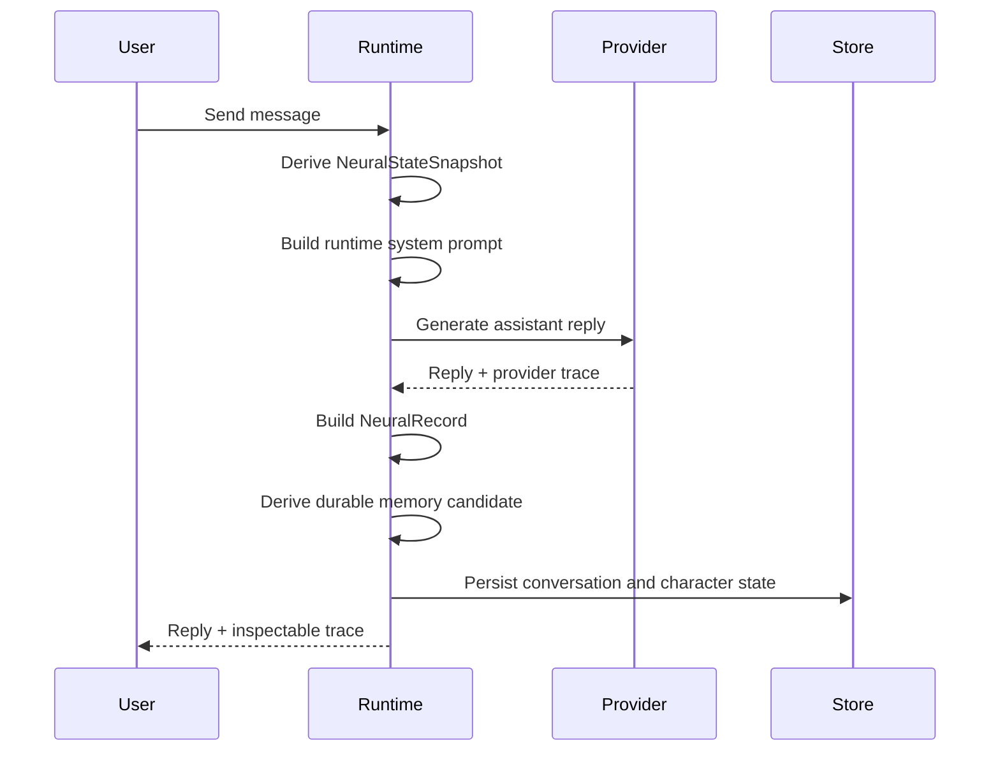

# Liberth Neural

[](LICENSE)
[](https://nodejs.org/)

Liberth Neural is an architecture research project for inspectable,
role-defined dialogue systems. It studies how you can turn a plain-language
character definition into a structured runtime made of a persona profile, a
neural graph, a prompt bundle, a memory layer, and a per-turn neural trace.

> **Note:** This is a preview feature currently under active development.

This repository is intentionally narrow. It does not try to solve general
agent orchestration, multimodal identity cloning, or production-grade
multi-tenant serving. It focuses on one question: how do you build a dialogue
runtime that stays legible after every turn?

## Why this repository exists

This repository is best read as a systems experiment, not a generic chatbot
template. The code explores a small set of architecture questions that are
easy to describe and hard to keep coherent in implementation.

- Can you compile loose role notes into stable runtime artifacts instead of
  relying on one opaque system prompt?
- Can you expose a readable per-turn trace without dumping raw hidden state?
- Can you combine local memory, route selection, and provider abstraction in
  one runtime that you can inspect end to end?
- Can you keep the stack local-first so you can replay and audit behavior
  without external orchestration infrastructure?

## Research stance

Liberth Neural treats "neural" as an architectural metaphor, not as a claim of
novel model training. The repository does not train a model, fine-tune
weights, or simulate biological cognition. It builds a symbolic runtime that
borrows neural vocabulary to make state transitions easier to reason about.

The central stance is simple: if a character runtime has memory, routes,
modulators, and priorities, you should be able to inspect those pieces as
first-class records.

## System boundary

You can think of the project as four coupled layers. Each layer exists so the
runtime can move from a text-defined role to an auditable assistant turn.



Within that boundary, the repository currently includes:

- a local blueprint compiler
- a route-based dialogue runtime
- a local persistence layer for characters and conversations
- a provider abstraction over native and OpenAI-compatible APIs
- a browser workspace for editing, chatting, and replaying neural records

Outside that boundary, the repository explicitly avoids:

- voice cloning
- avatar cloning
- scraped identity reconstruction
- autonomous tool execution loops
- distributed memory infrastructure
- high-scale serving guarantees

## Core artifacts

The runtime is easier to understand if you treat each artifact as a stable
interface rather than as incidental app state.

| Artifact | Purpose | Defined in |
| --- | --- | --- |
| `RoleDefinitionInput` | Human-authored role notes that seed the system | [`src/types.ts`](./src/types.ts) |
| `PersonaExtractProfile` | Structured identity, values, expertise, and style | [`server/neural-engine.ts`](./server/neural-engine.ts) |
| `NeuralBundleGraph` | Regions, neurons, circuits, synapses, and plasticity settings | [`src/types.ts`](./src/types.ts) |
| `RoleBlueprint` | Compiled output that packages profile, graph, bundle files, and system prompt | [`server/roles.ts`](./server/roles.ts) |
| `NeuralStateSnapshot` | Turn-level derived state for one user message | [`server/neural-engine.ts`](./server/neural-engine.ts) |
| `NeuralRecord` | Public trace attached to an assistant turn | [`server/index.ts`](./server/index.ts) |

Those artifacts are the real product of the system. The chat reply is only one
projection of them.

## Compilation pipeline

The repository starts from a plain-language role definition and compiles it
into a reusable blueprint. This keeps authoring separate from runtime
execution.

1. Parse the role form into `RoleDefinitionInput`.
2. Extract a normalized persona profile from the authored fields.
3. Build a local neural graph with regions, neurons, circuits, and plasticity
   rules.
4. Generate bundle files such as `AGENTS.md`, `SOUL.md`, `STYLE.md`, and
   `MEMORY.md`.
5. Assemble a `RoleBlueprint` that the runtime can consume on every turn.

The current implementation performs that compilation locally in
[`server/roles.ts`](./server/roles.ts) and
[`server/neural-engine.ts`](./server/neural-engine.ts). It does not require a
remote builder model to produce the baseline blueprint.

## Runtime loop

The runtime loop is the core research object in this repository. For each user
message, the system derives state first, then generates text, then decides what
to persist.



In concrete terms, the loop in [`POST /api/chat`](./server/index.ts) does the
following:

1. Load the selected character and latest conversation.
2. Convert recent messages into thread memories.
3. Combine thread memories, global memories, persona profile, and neural graph
   into a `NeuralStateSnapshot`.
4. Build a runtime system prompt from bundle files and the current neural
   state.
5. Call the selected provider adapter.
6. Attach a compact `NeuralRecord` to the assistant message.
7. Optionally consolidate a durable memory candidate into character memory.

The important design choice is ordering. State derivation happens before model
generation, and memory writeback happens after generation. That separation
keeps the architecture inspectable.

## Route model

Liberth Neural uses a small route vocabulary instead of a monolithic response
mode. The goal is not to simulate intelligence. The goal is to force the
runtime to explain what kind of answer it thinks it is producing.

The current route set is:

- `respond`
- `tool`
- `clarify`
- `learn`
- `reflect`

The dominant route becomes part of the public neural record. The runtime also
keeps route alternatives, supporting neurons, modulators, workspace contents,
and memory directives inside the same trace structure.

## Memory model

The memory model is deliberately conservative. The repository only stores local
thread context and local durable memories. It does not implement retrieval
augmentation over external databases or semantic vector search.

There are two memory scopes:

- `thread` memory from recent conversation turns
- `global` memory attached to the character record

On each turn, the runtime may derive a durable memory candidate. If the
candidate is strong enough and not duplicated, it is appended to the character
store and trimmed to the latest local window.

## Provider abstraction

The provider layer is part of the research design because it tests whether the
runtime can keep its architecture stable while the generation backend changes.
The dialogue logic sits above the provider adapters.

The current provider matrix includes:

| Provider | API style | Default model |
| --- | --- | --- |
| GLM | Native GLM | `glm-4-flash-250414` |
| OpenAI Compatible | OpenAI chat completions | `gpt-4.1-mini` |
| OpenRouter | OpenAI chat completions | `openai/gpt-4.1-mini` |
| DeepSeek | OpenAI chat completions | `deepseek-chat` |
| SiliconFlow | OpenAI chat completions | `Qwen/Qwen2.5-72B-Instruct` |
| Groq | OpenAI chat completions | `llama-3.3-70b-versatile` |
| Ollama | OpenAI chat completions | `qwen2.5:14b` |
| Anthropic | Native Messages API | `claude-3-5-haiku-latest` |
| Google Gemini | Native generateContent API | `gemini-2.0-flash` |

The provider adapter lives in [`server/llm.ts`](./server/llm.ts). The runtime
passes a compiled system prompt and short conversation history into that layer,
then stores the resulting provider trace alongside the assistant reply. GLM now
follows the same manual runtime-key flow as the other hosted providers, and the
API never returns saved provider keys to the frontend.

## Repository layout

The repository is small enough that you can read it as a single-node system.
The directory split reflects runtime concerns more than product features.

```text
liberth-neural-standalone/
├── server/        # Express API, runtime, providers, storage, and automation
├── src/           # React client and shared runtime types
├── data/          # Local persisted records
├── skills/        # Local skill workspace placeholder
├── .env.example   # Provider configuration template
└── package.json   # Dev, build, and typecheck commands
```

The highest-value files for architecture reading are:

- [`server/index.ts`](./server/index.ts) for the API boundary and runtime loop
- [`server/neural-engine.ts`](./server/neural-engine.ts) for state derivation
- [`server/roles.ts`](./server/roles.ts) for blueprint compilation
- [`server/llm.ts`](./server/llm.ts) for provider adaptation
- [`server/store.ts`](./server/store.ts) for local persistence
- [`src/types.ts`](./src/types.ts) for the artifact contracts

## API surface

The API is intentionally local and compact. It exists to expose the architecture
to the browser workspace, not to present a finished public platform contract.

The main routes are:

| Method | Path | Purpose |
| --- | --- | --- |
| `GET` | `/api/health` | Return local runtime health |
| `GET` | `/api/providers` | Return provider catalog and active provider |
| `GET` | `/api/settings/provider` | Load current provider settings |
| `PUT` | `/api/settings/provider` | Persist provider settings |
| `GET` | `/api/characters` | List local character records |
| `POST` | `/api/characters/generate` | Compile a blueprint preview |
| `POST` | `/api/characters` | Create a character |
| `PUT` | `/api/characters` | Update a character |
| `GET` | `/api/conversations?characterId=...` | Load latest conversation |
| `POST` | `/api/chat` | Execute one dialogue turn |
| `GET` | `/api/deployments?characterId=...` | List outbound route records |
| `POST` | `/api/deployments` | Create or update an outbound route |
| `POST` | `/api/deployments/:deploymentId/send-test` | Send a test delivery |
| `GET` | `/api/conversations/:conversationId/export?format=json|markdown` | Export a conversation |
| `GET` | `/api/characters/:characterId/neural-state` | Inspect latest neural state |
| `GET` | `/api/conversations/:conversationId/neural-records` | Replay assistant traces |

The outbound layer is intentionally narrow. It currently supports three local
delivery targets:

- `webhook` for full JSON payload delivery
- `slack` for text summaries through `chat.postMessage`
- `telegram` for text summaries through `sendMessage`

Those endpoints live in [`server/index.ts`](./server/index.ts). They are useful
for routing local dialogue traces into surrounding tools, but they remain an
adjunct surface around the core runtime rather than the architectural center of
the project.

## Local-first persistence

The storage model is intentionally simple because the research focus is
inspectability, not infrastructure abstraction. Characters, conversations,
global memories, provider settings, and related records are stored locally and
updated through the server layer.

This choice has two effects:

- You can inspect state transitions directly without standing up a database.
- You do not get transactional guarantees, horizontal scaling, or production
  isolation out of the box.

If you evaluate the repository as a research codebase, that tradeoff is
deliberate. If you evaluate it as a hosted product backend, that tradeoff is a
clear limitation.

## Running the project

You can run the repository locally as a single Node.js application with a Vite
client and an Express server.

1. Clone the repository.
2. Install dependencies.
3. Copy the environment template.
4. Start the development servers.

```bash
git clone https://github.com/Libre-Connect/liberth-neural.git
cd liberth-neural
npm install
cp .env.example .env
npm run dev
```

The Vite client runs at `http://localhost:5178`. The Express server defaults
to `http://localhost:4318`.

## Environment

You configure provider access through the runtime settings panel. API keys are
write-only there, so the server stores them without echoing them back to the
client. [`.env.example`](./.env.example) still contains optional server-side
defaults for OpenAI-compatible endpoints, OpenRouter, DeepSeek, SiliconFlow,
Groq, Ollama, Anthropic, and Google Gemini. GLM intentionally uses the runtime
settings flow for its API key.

If you only want local inspection without live model calls, you can still read
the compiled blueprint path and type contracts. If you want full chat runtime
behavior, you must configure at least one provider.

## Development commands

The repository uses a small command surface. It is enough to build, run, and
typecheck the architecture without extra tooling.

```bash
npm run dev
npm run dev:server
npm run dev:client
npm run build
npm run build:client
npm run build:server
npm run check
```

At the moment, `npm run check` runs the TypeScript typecheck. The repository
does not yet ship a broader automated test suite.

## What this repository is good for

You should use this repository if you want to study or extend:

- role-to-runtime compilation
- inspectable dialogue routing
- compact memory writeback rules
- provider-agnostic character chat runtimes
- local-first research prototypes for agent architecture

You should not use this repository as-is if you need:

- production-grade multi-user isolation
- audited security boundaries
- distributed storage
- retrieval pipelines over large corpora
- long-running autonomous tools

## Current limitations

The current implementation favors readability and architectural clarity over
completeness. That means several limits are explicit rather than hidden.

- The blueprint compiler is local and heuristic.
- Memory writeback is simple and window-bounded.
- The runtime uses local file-backed storage.
- The API is shaped for the bundled workspace.
- The project is still early-stage and exploratory.

## License

This repository is released under [AGPL-3.0-or-later](./LICENSE).

## Next steps

If you want to work on this repository as an architecture artifact, start with
[`server/neural-engine.ts`](./server/neural-engine.ts) and
[`src/types.ts`](./src/types.ts). If you want to push it toward a reusable
open-source runtime, the next obvious steps are test coverage, release
packaging, and separation of the core runtime from the browser workspace.
